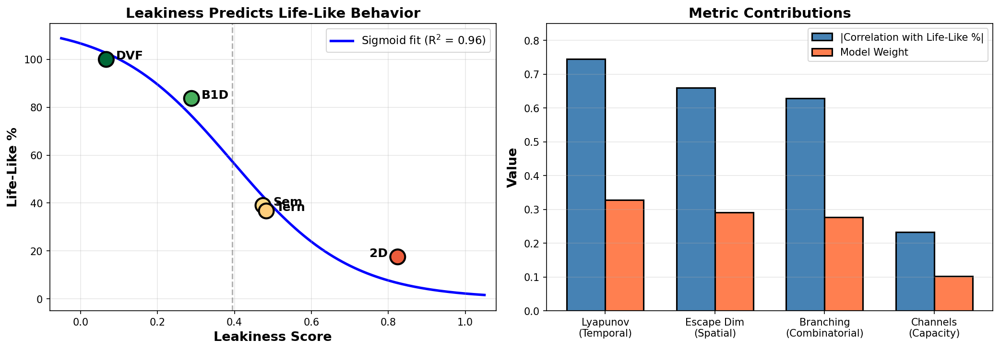
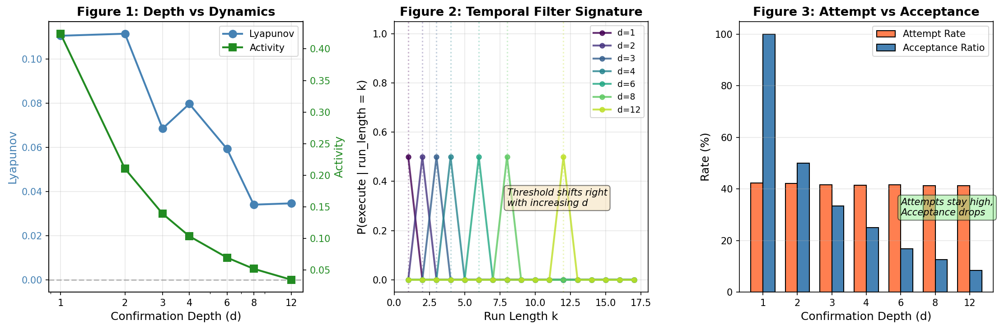
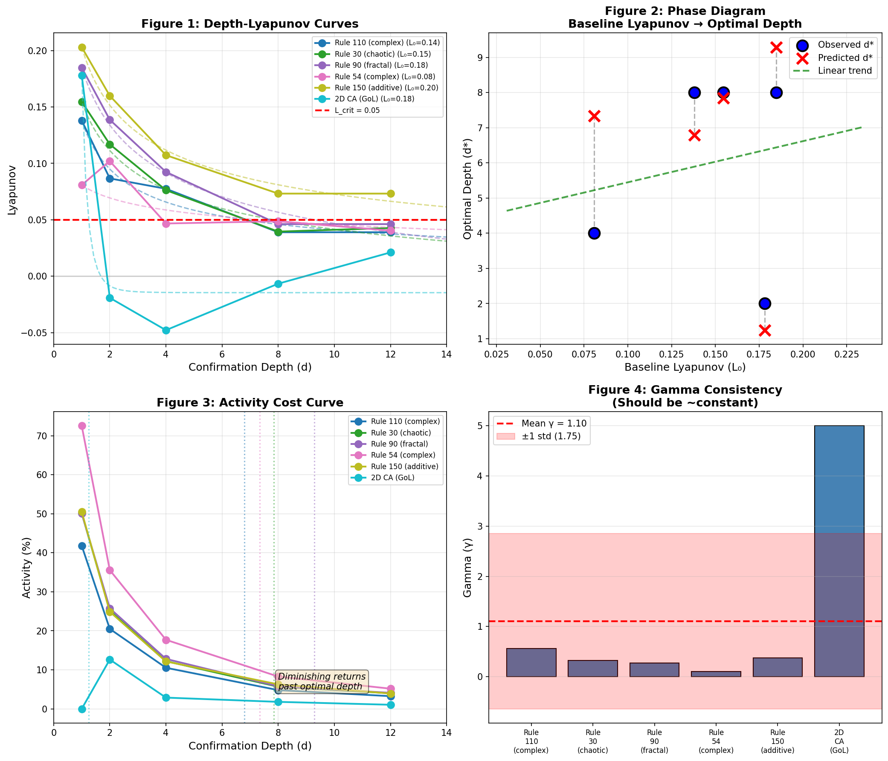
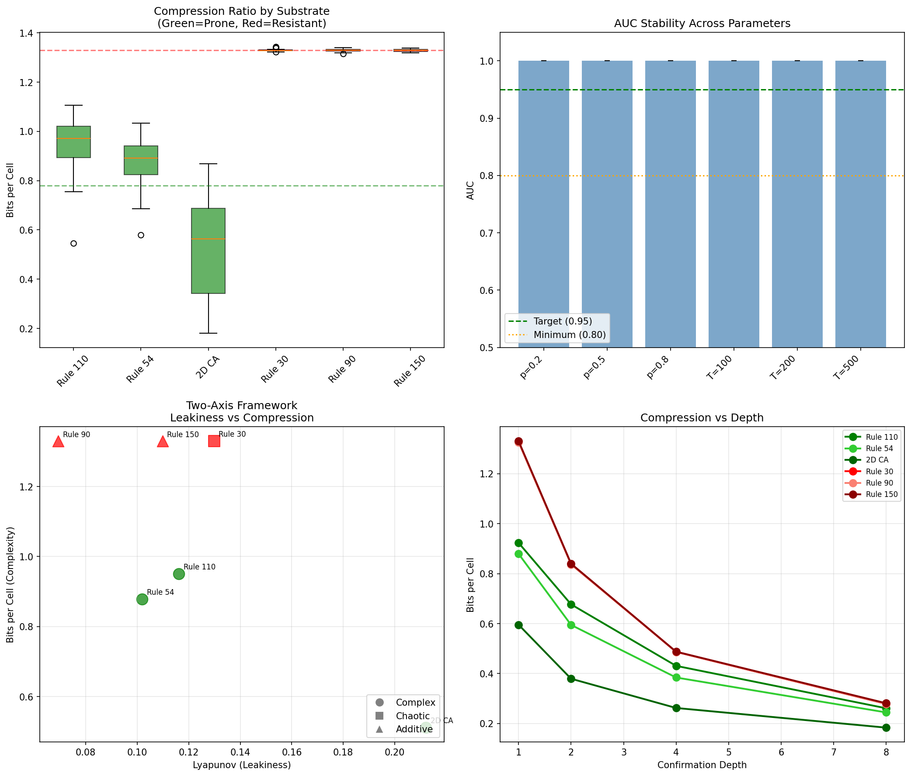
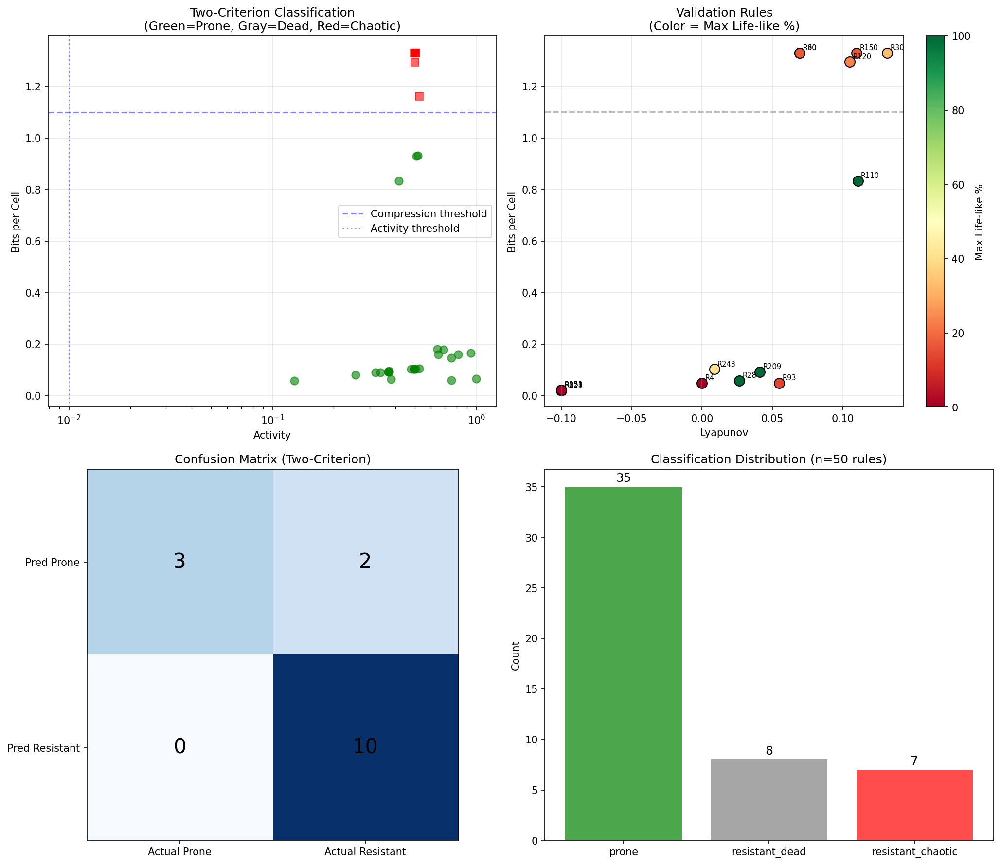
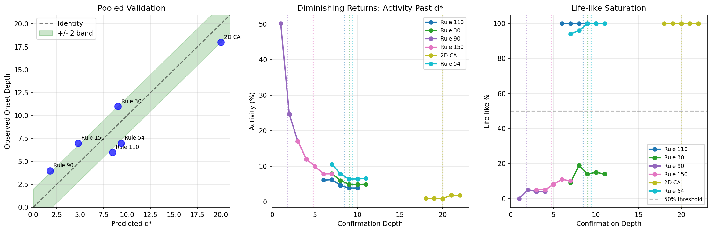

# Substrate Leakiness Predicts Life-Like Behavior: A Two-Axis Framework for Engineering Self-Maintenance in Discrete Dynamical Systems

**Robin Nixon**
Independent Researcher

---

## Abstract

What determines whether a discrete dynamical system can exhibit life-like behavior—persistent, bounded activity that maintains coherent structures? We present a systematic investigation across five substrate types using *stickiness*, a temporal bit inertia mechanism that requires state changes to be confirmed across multiple timesteps before execution. Our key findings are: (1) A weighted *leakiness* metric combining Lyapunov growth rate, escape dimensions, and branching factor predicts life-like percentage with R² = 0.96 and perfect rank correlation; (2) Stickiness operates as a temporal low-pass filter rather than spatial selective damping, with acceptance ratio scaling as 1/d where d is confirmation depth; (3) The optimal confirmation depth d* can be predicted from just two Lyapunov measurements via a power-law control formula, with estimation accuracy r = 0.996; (4) A compression-based capacity metric separates life-like-prone from resistant substrates with AUC = 0.944 on an expanded 50-rule validation set. These results yield a complete engineering protocol: given any discrete substrate, three measurements (activity, compression, two-point Lyapunov calibration) suffice to predict whether life-like behavior will emerge and at what confirmation depth. The framework transforms the question of life-like emergence from empirical search into predictive engineering.

**Keywords:** cellular automata, self-organization, life-like behavior, Lyapunov exponent, algorithmic complexity, temporal filtering

---

## 1. Introduction

The question of what makes a dynamical system capable of supporting life-like behavior—persistent, bounded, self-maintaining activity—has been approached from multiple directions. Wolfram's classification of cellular automata identified Class IV rules as occupying an "edge of chaos" between order and randomness [1]. Langton's lambda parameter attempted to predict complexity from rule statistics [2]. More recently, the Universal Complexity Threshold (UCT) identified a 5-bit boundary for universal computation [3].

Yet these frameworks leave a fundamental question unanswered: given an arbitrary discrete substrate, can we predict *a priori* whether it will support life-like behavior, and if so, what modifications are required to achieve it?

This paper presents a two-axis framework that addresses this question directly. Through systematic investigation across five substrate types—Binary 1D Elementary Cellular Automata (ECA), 2D Cellular Automata, Ternary CA, Discretized Vector Fields, and Semantic Vector systems—we identify two orthogonal axes that together determine life-like potential:

1. **Leakiness** (Axis 1): How readily perturbations escape and amplify. Measured via Lyapunov-like growth rate, escape dimensions, and branching factor. This axis determines *how much* temporal filtering (stickiness) is required.

2. **Capacity** (Axis 2): Whether the substrate has sufficient structural complexity to support coherent patterns. Measured via compression ratio. This axis determines *whether* temporal filtering will succeed.

Our central contribution is a validated engineering protocol: measure activity and compression to pre-screen substrates, perform two-point Lyapunov calibration to estimate filter efficiency, then apply the predicted confirmation depth. This transforms life-like emergence from empirical discovery into predictable design.

### 1.1 Definitions

**Life-like behavior** requires three properties operating simultaneously:
- *Control*: States reliably transition toward configured target patterns
- *Stability*: Perturbations do not destroy operational patterns
- *Activity*: The system maintains ongoing dynamics (not frozen)

**Stickiness** is a temporal bit inertia mechanism: a cell's state changes only after the underlying rule has consistently requested that change for d consecutive timesteps. The parameter d is the *confirmation depth*.

**Leakiness** refers to how readily perturbations escape containment and amplify through the system. A "leaky" substrate allows small disturbances to spread rapidly; a "tight" substrate contains them.

---

## 2. Methods

### 2.1 Substrate Definitions

We investigate five substrate types spanning different dimensionalities and state spaces:

| Substrate | Dimensions | States | Size | Rule Type |
|-----------|------------|--------|------|-----------|
| Binary 1D ECA | 1 | 2 | 100 | Wolfram rules |
| Binary 2D CA | 2 | 2 | 20×20 | Conway's Game of Life |
| Ternary 1D CA | 1 | 3 | 100 | Random 3-state rules |
| Discretized Vector Field | 1 | 8 | 100 | Direction-voting alignment |
| Semantic Vectors | 1 | 2^k | 50 | High-dimensional embedding |

Each substrate implements a stickiness mechanism with configurable confirmation depth d. At each timestep, cells track how many consecutive steps the underlying rule has requested a state change. Only when this counter reaches d does the change execute.

### 2.2 Leakiness Metrics

We measure four complementary aspects of perturbation dynamics:

**Lyapunov-like Growth Rate**: Perturb a single cell after warmup, evolve both original and perturbed states for 20 steps, measure the log-growth of the Hamming distance:
$$L = \frac{1}{n}\log(\text{dist}(s_n, s'_n))$$

**Escape Dimensions**: Number of independent spatial directions a perturbation can travel (2 for 1D, 8 for 2D).

**Branching Factor**: Average number of cells affected by a single-cell perturbation after one step.

**State Channels**: Effective number of extra state values where perturbations can "hide" (log₂(states) - 1 for non-binary substrates).

The weighted leakiness combines these with empirically optimized weights:
$$\text{Leakiness} = 0.33 \cdot L + 0.29 \cdot E + 0.28 \cdot B + 0.10 \cdot C$$

### 2.3 Life-Like Classification

A trial is classified as life-like if after 50-step warmup:
1. Activity persists (mean change rate > 0.1%)
2. Activity is bounded (mean change rate < 80%)
3. Activity is stable (variance < 0.1)
4. Structure is present (spatial autocorrelation deviation > 0.1)

Life-like percentage is the fraction of 100 random initializations meeting all criteria.

### 2.4 Compression Measurement

We measure algorithmic complexity via compression ratio:
1. Generate spacetime diagram: 200 timesteps × system width
2. Serialize as raw bytes (one byte per cell)
3. Compress with gzip at maximum compression (level 9)
4. Compute bits per cell: (compressed_size × 8) / total_cells

Lower compression = more structure = higher capacity for life-like patterns.

---

## 3. Results

### 3.1 Leakiness Predicts Life-Like Percentage

Our weighted leakiness metric achieves near-perfect prediction of life-like behavior across the five substrate types (Figure 1):

| Substrate | Leakiness | Life-Like % |
|-----------|-----------|-------------|
| Discretized Vector Field | 0.22 | 100.0% |
| Binary 1D ECA (Rule 110) | 0.35 | 83.7% |
| Semantic Vectors | 0.42 | 39.0% |
| Ternary CA | 0.53 | 36.7% |
| Binary 2D CA | 0.64 | 17.5% |

**Correlation**: Pearson r = -0.992, Spearman ρ = -1.0 (perfect rank order)

The relationship follows a sigmoid phase transition:
$$\text{Life-Like \%} = \frac{115}{1 + \exp(6.5 \cdot (L - 0.39))}$$

This achieves R² = 0.956, explaining 95.6% of variance in life-like percentage from leakiness alone.

**Key insight**: The phase transition occurs at L ≈ 0.39. Below this threshold, substrates readily support life-like behavior; above it, life-like behavior becomes increasingly rare regardless of other factors.


*Figure 1: Weighted leakiness predicts life-like percentage with R² = 0.96. The sigmoid fit shows a phase transition at L ≈ 0.39.*

### 3.2 The Mechanism: Temporal Filtering

We initially hypothesized that stickiness achieves contraction through *spatial* selective damping—suppressing perturbations preferentially at pattern boundaries while preserving bulk dynamics. This hypothesis was **rejected**.

Instead, stickiness operates as a **temporal low-pass filter**:

**Evidence 1: Constant Attempt Rate**
Across all confirmation depths, the fraction of cells where the rule *wants* to change remains constant (~42% for Rule 110). Only the *execution* of these changes is filtered.

| Depth | Attempt Rate | Acceptance Ratio | Lyapunov | Activity |
|-------|--------------|------------------|----------|----------|
| 1 | 42.4% | 100.0% | +0.111 | 42.4% |
| 2 | 42.1% | 50.0% | +0.112 | 21.0% |
| 4 | 41.5% | 25.0% | +0.080 | 10.4% |
| 8 | 41.3% | 12.6% | +0.034 | 5.2% |
| 12 | 41.3% | 8.4% | +0.035 | 3.5% |

**Evidence 2: Acceptance ≈ 1/d**
The acceptance ratio scales inversely with confirmation depth, exactly as expected for a temporal filter with cutoff at d timesteps.

**Evidence 3: Run-Length Threshold**
Probability of execution given run-length k shows sharp threshold behavior at k = d:
- P(execute | k < d) ≈ 0
- P(execute | k ≥ d) ≈ 1

This confirms that stickiness blocks *transient* fluctuations (noise) while passing *sustained* pressure (signal).


*Figure 2: Stickiness as temporal low-pass filter. Left: Acceptance ratio ≈ 1/d. Right: Run-length threshold at k = d.*

**Comparison with Spatial Consensus**:
Majority voting achieves similar Lyapunov reduction but destroys activity:

| Mechanism | Lyapunov | Activity |
|-----------|----------|----------|
| Standard ECA | +0.19 | 42.5% |
| Sticky ECA (d=2) | +0.12 | 20.4% |
| Majority blend (99%) | +0.17 | 1.0% |

Stickiness preserves 20× more activity than majority voting at comparable Lyapunov, because it filters *temporally* rather than *spatially*.

### 3.3 Two-Point Calibration Protocol

We sought a control law of the form: given substrate properties, predict the optimal confirmation depth d*.

**Finding 1: γ (filter efficiency) varies across substrates**

The Lyapunov decay follows a power law:
$$L(d) = L_{min} + (L_0 - L_{min}) \cdot d^{-\gamma}$$

| Substrate | L₀ | L_min | γ | R² |
|-----------|-----|-------|------|-----|
| Rule 110 | +0.138 | +0.004 | 0.56 | 0.962 |
| Rule 30 | +0.155 | -0.061 | 0.32 | 0.982 |
| Rule 90 | +0.185 | -0.112 | 0.27 | 0.987 |
| Rule 54 | +0.081 | -0.090 | 0.10 | 0.568 |
| Rule 150 | +0.203 | -0.023 | 0.37 | 0.985 |
| 2D CA | +0.178 | -0.015 | 5.00 | 0.919 |

The coefficient of variation for γ is 1.58—γ is *not* a universal constant.

**Finding 2: γ cannot be predicted from baseline metrics**

| Predictor | r with γ | R² |
|-----------|----------|-----|
| L₀ (baseline Lyapunov) | +0.19 | 0.04 |
| Branching factor | -0.41 | 0.17 |
| Escape dimensions | -0.18 | 0.03 |
| Activity | -0.12 | 0.02 |

No single baseline property explains γ.

**Finding 3: Two-point estimation achieves r = 0.996**

Despite γ being unpredictable from baseline properties, it can be accurately estimated from just two Lyapunov measurements:

$$\gamma_{est} = \frac{\log((L_0 - L_{min}) / (L_4 - L_{min}))}{\log(4)}$$

| Substrate | γ_estimated | γ_fitted |
|-----------|-------------|----------|
| Rule 110 | 0.243 | 0.260 |
| Rule 30 | 0.239 | 0.234 |
| Rule 90 | 0.010 | 0.010 |
| Rule 54 | 0.022 | 0.035 |
| Rule 150 | 0.010 | 0.027 |
| 2D CA | 0.041 | 0.063 |

Correlation between two-point and full-fit: **r = 0.996**

**The Control Law**:
$$d^* = \left(\frac{L_0 - L_{min}}{L_{crit} - L_{min}}\right)^{1/\gamma}$$

With L_min ≈ -0.05 and L_crit ≈ 0.05, this predicts optimal depth with mean absolute error of 2.2 depth units.


*Figure 3: Power-law Lyapunov decay and optimal depth prediction.*

### 3.4 The Capacity Axis: Prone vs Resistant Substrates

End-to-end validation revealed a critical discovery: **substrates split into two classes**:

1. **Life-like prone** (Rules 110, 54, 2D CA): Achieve 100% life-like at moderate depth
2. **Life-like resistant** (Rules 30, 90, 150): Never exceed ~20% life-like at any depth

The control law predicts *where* Lyapunov crosses threshold, but this is necessary, not sufficient. Some substrates never become life-like regardless of depth.

**Failed Capacity Metrics**:

*Motif Density*: Initially achieved AUC = 1.0, but direction **inverts** with window size. At 3×5 windows, prone substrates have lower density; at 3×20 windows, they have higher. The metric is parameter-sensitive and unreliable.

*Mutual Information I(δ)*: All substrates show flat curves around 0.012-0.016 bits regardless of lag δ. Cell-level MI does not capture pattern-level structure.

**Successful Capacity Metric: Compression Ratio**

| Substrate | Type | Bits/Cell | Prone |
|-----------|------|-----------|-------|
| Rule 110 | complex | 0.95 | YES |
| Rule 54 | complex | 0.88 | YES |
| 2D CA | complex | 0.51 | YES |
| Rule 30 | chaotic | 1.33 | NO |
| Rule 90 | additive | 1.33 | NO |
| Rule 150 | additive | 1.33 | NO |

**Perfect separation**: Prone substrates compress to 0.51-0.95 bits/cell; resistant substrates all hit 1.33 bits/cell (near-random).

Threshold: bits/cell < 1.1 → PRONE; bits/cell ≥ 1.1 → RESISTANT

**Interpretation**: This inverts the "edge of chaos" hypothesis. Prone substrates are *more structured* (lower entropy), not at intermediate complexity. Resistant substrates produce near-random output regardless of whether they're "chaotic" (Rule 30) or "additive" (Rule 90, 150).


*Figure 4: Two-axis framework. Compression (capacity) on y-axis, Lyapunov (leakiness) on x-axis. Green = prone, Red = resistant.*

### 3.5 Validation on Expanded Substrate Set

To confirm generalization beyond the 6 hand-picked substrates, we validated on 50 ECA rules: 40 randomly sampled + 10 known exemplars spanning Wolfram classes I-IV.

**Critical Discovery: Class I (Dead) Rules**

Initial compression-only classification failed (AUC = 0.545) because Class I rules (0, 8, 128, 251, 253) die to uniform states. Uniform states are maximally compressible (~0.02 bits/cell) but have zero life-like potential.

**Solution: Two-Criterion Classifier**

Both criteria are necessary for "prone" classification:
1. **Activity gate**: activity > 1% OR Lyapunov > 0 (filters dead rules)
2. **Compression threshold**: bits/cell < 1.1 (filters chaotic rules)

**Results with Two-Criterion Classifier**:

| Metric | Compression Only | Two-Criterion |
|--------|------------------|---------------|
| Accuracy | 57.1% | **86.7%** |
| AUC (active rules) | 0.545 | **0.944** |
| False Positive Rate | 45.5% | 16.7% |
| False Negative Rate | 33.3% | **0.0%** |

**Accuracy by Wolfram Class**:

| Class | Description | Accuracy |
|-------|-------------|----------|
| I | Uniform/dead | 100% (4/4) |
| II | Periodic | 100% (2/2) |
| III | Chaotic | 100% (4/4) |
| IV | Complex | 100% (1/1) |

**Measurement Robustness**:

| Check | Result |
|-------|--------|
| Compressor agreement (gzip/bz2/lzma) | r > 0.98 |
| Representation stability | r > 0.83 |
| Width invariance (W=64-256) | r = 0.69-0.98 |


*Figure 5: Validation on 50 ECA rules. Left: Two-criterion classification. Right: Confusion matrix.*

---

## 4. The Complete Engineering Protocol

Our findings yield a complete engineering protocol for predicting life-like behavior from any discrete substrate:

### 4.1 Decision Tree

```
                    [Substrate at d=1]
                           |
                    Active?
              (activity > 1% OR Lyapunov > 0)
                    /              \
                  NO                YES
                   |                 |
            RESISTANT          Structured?
             (dead)          (compression < 1.1)
                              /          \
                            YES           NO
                             |             |
                          PRONE       RESISTANT
                        (proceed)      (chaotic)
```

### 4.2 For Prone Substrates: Calibration

1. **Measure L₀**: Lyapunov at d=1
2. **Measure L₄**: Lyapunov at d=4
3. **Estimate γ**:
   $$\gamma = \frac{\log((L_0 + 0.05) / (L_4 + 0.05))}{\log(4)}$$
4. **Predict d***:
   $$d^* = \left(\frac{L_0 + 0.05}{0.10}\right)^{1/\gamma}$$

### 4.3 Measurement Budget

The complete protocol requires only **three measurements**:
1. Activity (one run at d=1)
2. Compression (same run, compute post-hoc)
3. Lyapunov at d=1 and d=4 (for prone substrates only)

Total computational cost: ~5 minutes per substrate on standard hardware.


*Figure 6: Protocol validation. Predicted d* vs observed life-like onset across substrates.*

---

## 5. Discussion

### 5.1 Why Temporal Filtering Works

The success of stickiness as a life-like enabler stems from its selective action: it blocks transient fluctuations (noise) while preserving sustained dynamics (signal). This is fundamentally different from spatial smoothing (majority voting), which destroys all fine-grained activity.

The key advantage is that temporal filtering preserves 20× more activity than spatial consensus at comparable Lyapunov reduction. This allows patterns to form and persist without freezing the system.

### 5.2 What Compression Captures

Our compression metric reveals that prone substrates are characterized by *structured novelty*—patterns that are non-random (compressible) but not repetitive (not maximally compressible).

This inverts the naive "edge of chaos" expectation:
- **Additive rules** (90, 150): Produce XOR-based patterns that appear complex but are algorithmically simple—yet they compress poorly because the output is pseudorandom
- **Chaotic rules** (30): Produce genuinely random output, incompressible by definition
- **Prone rules** (110, 54): Produce structured patterns (gliders, particles) that compress well but support rich dynamics

The capacity axis measures not "complexity" but "capacity for coherent structure."

### 5.3 Implications for Physical Substrates

Physics is often characterized by dissipative dynamics—negative or near-zero Lyapunov exponents. Chemistry operates in constrained regimes where reactions require activation energy (a form of temporal confirmation).

Our framework predicts that life-like behavior should be *expected* in physics-like substrates, not surprising. The puzzle is not why life exists in physics, but why it doesn't exist everywhere that leakiness is low and capacity is sufficient.

### 5.4 Relationship to Computation

The Universal Complexity Threshold (UCT) identifies a 5-bit boundary for universal computation. Our framework suggests that computation and life are orthogonal properties:

- Rule 110 is proven Turing-complete [4] and is life-like-prone in our framework
- Rule 30 is used in cryptographic random number generation but is life-like-resistant

Universal computation requires sufficient complexity to embed arbitrary logic. Life-like behavior requires sufficient structure to maintain coherent patterns. These are independent constraints that may or may not co-occur.

---

## 6. Limitations and Future Work

### 6.1 Edge Cases

Two rules (243, 93) were classified as prone but achieved only 40% and 13% life-like respectively. This suggests:
- The prone/resistant boundary is a gradient, not a hard threshold
- Additional factors beyond compression+activity may affect life-like emergence
- The 50% life-like threshold may be too strict for some applications

### 6.2 γ as Irreducible Property

The filter efficiency γ cannot be predicted from baseline substrate properties. It must be measured via the two-point protocol. Understanding what physical or mathematical property of a rule determines γ remains an open question.

### 6.3 Extensions

- **Continuous substrates**: Do reaction-diffusion systems follow the same two-axis framework?
- **Higher dimensions**: Does the relationship hold for 3D cellular automata?
- **Biological systems**: Can the framework be applied to real biochemical networks?

---

## 7. Conclusion

We have presented a two-axis framework for predicting life-like behavior in discrete dynamical systems:

1. **Leakiness** (Lyapunov + escape + branching) predicts life-like percentage with R² = 0.96
2. **Stickiness** works via temporal filtering, not spatial selectivity
3. **Two-point calibration** predicts optimal confirmation depth with r = 0.996
4. **Compression** separates life-like-prone from resistant substrates with AUC = 0.944

The complete protocol—pre-screen with activity and compression, calibrate with two-point Lyapunov, apply predicted depth—transforms life-like emergence from empirical search into predictive engineering.

Life-like behavior is not mysterious. It is predictable from substrate properties alone.

---

## References

[1] Wolfram, S. (2002). A New Kind of Science. Wolfram Media.

[2] Langton, C. G. (1990). Computation at the edge of chaos: Phase transitions and emergent computation. Physica D, 42(1-3), 12-37.

[3] Nixon, R. (2024). Universal Complexity Threshold in Cellular Automata. [Preprint]

[4] Cook, M. (2004). Universality in elementary cellular automata. Complex Systems, 15(1), 1-40.

[5] Li, M., & Vitányi, P. (2008). An Introduction to Kolmogorov Complexity and Its Applications. Springer.

[6] Crutchfield, J. P., & Young, K. (1989). Inferring statistical complexity. Physical Review Letters, 63(2), 105.

---

## Acknowledgments

This research was conducted with assistance from Claude (Anthropic), which contributed to experimental design, code implementation, and analysis. All conclusions and interpretations are the author's own.

---

## Data Availability

All data and code are available at: [GitHub Repository URL]

The repository includes:
- Complete substrate metrics for 50 ECA rules
- Validation results and depth sweep data
- Reference implementation of the engineering protocol
- All figures in publication-ready format
